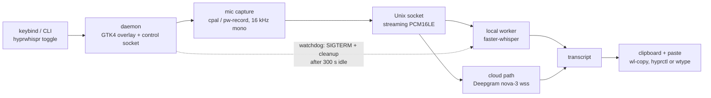

<div align="center">

# HyprWhispr

Wispr Flow-style voice dictation on Linux: hold a keybind, speak, release — text is pasted at the cursor.

[](https://github.com/AdamUnderwood375/HyprWhispr/actions/workflows/ci.yml) [](LICENSE) [](Cargo.toml) [](README.md)

</div>

> Default provider is local faster-whisper — no API key needed, and zero processes resident when idle.

## What it is

HyprWhispr is a small Rust daemon (edition 2024, ~1,560 lines across `src/{main,config,audio,local,deepgram,overlay,inject}.rs` plus `local_worker.py` and `examples/probe.rs`) that gives you push-to-talk dictation on Wayland. A GTK4 layer-shell pill overlay shows live state, interim transcripts render in the pill while you speak, and the final transcript is pasted at the cursor via clipboard + paste injection.

The default STT backend is local faster-whisper. Deepgram `nova-3` cloud streaming is optional via `provider = "deepgram"` plus `DEEPGRAM_API_KEY`.

## Why it's fast

Audio streams to the STT worker over a Unix socket **while you speak**, so on key-release only the tail (~300–500 ms) is outstanding — instead of uploading a whole WAV or loading a model after the fact. Interim (`partial`) transcripts render live in the pill.

## Why there's nothing in RAM between dictations

Neither the daemon nor the model sits in RAM while you're not dictating:

- **No autostart.** The keybind runs `hyprwhispr toggle`; the daemon spawns on first press (~80 ms) and connects once its socket is bound.
- **No pre-warm.** The worker is spawned by the first dictation press, not at daemon startup.
- **Watchdog releases the model.** After 300 s with no sessions the worker gets `SIGTERM` plus socket cleanup. The daemon also takes the worker down on shutdown.

Re-toggles inside that window are instant. After it, the next press pays a ~2–3 s model load, which the overlay shows as a `Loading model` pill with a spinner. The mic stays open the whole time, so nothing said during those seconds is lost.

Idle cost is zero processes. The TTL lives in `src/local.rs` (`TTL_TICK_SECS = 15`):

```rust
const IDLE_TTL_SECS: u64 = 300;
```

## Architecture



## Features

- Push-to-talk dictation: first press records, second stops, transcribes, pastes.
- GTK4 layer-shell pill overlay with live interim transcripts and a `Loading model` spinner state.
- Local-first STT: faster-whisper over a Unix socket, no API key, CPU + int8 + 4 threads.
- Optional Deepgram `nova-3` cloud streaming with configurable endpointing.
- 16 kHz mono capture pipeline with `cpal`, downmixed to mono.
- Clipboard paste with optional restore (`preserve_clipboard`).
- Daemon state published for shell bars (`idle`, `loading`, `recording`, `transcribing`, `offline`).
- Stale-state-proof design: the state file is deleted on exit, so a crash can't leave old state behind.

## Quick start

### Local — no API key (default)

```bash
pip install faster-whisper numpy
cargo build --release
install -m755 target/release/hyprwhispr ~/.local/bin/hyprwhispr
install -m755 local_worker.py ~/.local/bin/local_worker.py
hyprwhispr        # run the daemon in the foreground; first run writes ~/.config/hyprwhispr/config.toml
```

`provider = "local"` is the default. No API key needed.

### Deepgram — cloud streaming (optional)

```bash
export DEEPGRAM_API_KEY="your-key-here"
```

Then set `provider = "deepgram"` in `~/.config/hyprwhispr/config.toml` (see Configuration below).

## System dependencies

```bash
sudo pacman -S gtk4 gtk4-layer-shell wl-clipboard pkg-config  # Arch
```

Also required at runtime:

- `wl-copy` for clipboard paste.
- `hyprctl` or `wtype` for paste injection.
- `pw-record` for mic capture.

## Usage

The keybind starts the daemon on demand — no autostart needed:

```bash
hyprwhispr toggle   # what the keybind runs: first press records, second stops/transcribes/pastes
hyprwhispr          # run the daemon in the foreground and watch its log
```

Speak after the first press; on the second press the transcript is pasted at the cursor.

## Shell-bar and Quickshell tile

The daemon publishes its state to `/tmp/hyprwhispr-state` (`idle`, `loading`, `recording`, `transcribing`, `offline`) and deletes the file on exit, so a crash can't leave a stale file. A Quickshell tile polls that file and shells out to `hyprwhispr toggle`.

Before the first press the file is absent, so the tile reads `offline`.

## Hyprland keybind

Bind `CTRL + mainMod + V` with `locked = true`:

```lua
hl.bind("CTRL + " .. mainMod .. " + V",
        hl.dsp.exec_cmd("hyprwhispr toggle"),
        { locked = true, description = "Dictation (HyprWhispr)" })
```

## Configuration

Config file: `~/.config/hyprwhispr/config.toml` (written on first run).

```toml
api_key = ""              # or $DEEPGRAM_API_KEY (only for provider = "deepgram")
model = "nova-3"          # Deepgram model
language = "en"
endpointing = 300         # ms of silence before Deepgram finalizes a segment
preserve_clipboard = false
provider = "local"        # "local" | "deepgram"
local_model = "tiny.en"   # faster-whisper model: "tiny.en", "base.en", "small.en", etc.
```

| Key | Default | Description |
|-----|---------|-------------|
| `api_key` | `""` | Deepgram API key, or `$DEEPGRAM_API_KEY`. Required only when `provider = "deepgram"`. |
| `model` | `"nova-3"` | Deepgram model name. |
| `language` | `"en"` | Language code. |
| `endpointing` | `300` | ms of silence before Deepgram finalizes a segment. |
| `preserve_clipboard` | `false` | Restore clipboard after paste. |
| `provider` | `"local"` | STT backend: `"local"` (faster-whisper, no API key) or `"deepgram"` (cloud streaming). |
| `local_model` | `"tiny.en"` | faster-whisper model. `tiny.en` is ~240 MB RSS int8; larger models are more accurate and heavier. |

## How it works

### Daemon lifecycle

Every dictation is on-demand. The keybind runs `hyprwhispr toggle`: on the first press the daemon spawns (~80 ms) and the CLI connects once its control socket is bound. That first press also spawns the STT worker (no pre-warm at daemon startup). When recording stops, audio already streamed over the Unix socket is finalized and the transcript is pasted at the cursor. If 300 s pass with no sessions, the watchdog (`TTL_TICK_SECS = 15` tick) sends `SIGTERM` to the worker and cleans up the socket; shutting down the daemon takes the worker down too.

### Local worker protocol (`local_worker.py`)

The client connects to a Unix socket (default `$XDG_RUNTIME_DIR/hyprwhispr-local.sock`, overridable with `HYPRWHISPR_LOCAL_SOCK` or a positional arg), sends a 4-byte LE `u32` sample rate, then streams raw PCM16LE mono. The worker replies with line-delimited JSON:

```json
{"interim": "..."}
{"final": "..."}
{"error": "..."}
```

The model is chosen via `HYPRWHISPR_MODEL` or `--model=`. Inference runs on CPU with int8 and 4 threads.

### Audio pipeline

Capture is done with `cpal` at a preferred 16 kHz, downmixed to mono, with `pw-record` used for mic capture at runtime. Because PCM frames flow over the socket during the utterance, only the final ~300–500 ms tail remains to be transcribed after the stop press.

## Self-check

```bash
cargo run --example probe   # speak ~3 s; requires DEEPGRAM_API_KEY — Deepgram path only
```

## Repository layout

```text
src/main.rs       # CLI + daemon entry (toggle / foreground)
src/config.rs     # ~/.config/hyprwhispr/config.toml load + defaults
src/audio.rs      # cpal capture, 16 kHz mono pipeline
src/local.rs      # local worker spawn, socket client, 300 s idle watchdog
src/deepgram.rs   # Deepgram nova-3 streaming path (wss)
src/overlay.rs     # GTK4 layer-shell pill, spinner + interim text
src/inject.rs     # clipboard + paste injection (wl-copy, hyprctl/wtype)
local_worker.py   # faster-whisper Unix-socket worker (PCM16LE in, JSON lines out)
examples/probe.rs # self-check probe (Deepgram path only)
```

## CI and development

CI is defined in `.github/workflows/ci.yml` (workflow name `ci`): `ubuntu-latest`, stable Rust with clippy + rustfmt, installs `libgtk-4-dev libgtk4-layer-shell-dev pkg-config`, then runs:

```bash
cargo fmt --check
cargo clippy -- -D warnings
cargo test
```

Main dependencies: `anyhow`, `async-channel`, `cpal 0.18`, `dirs`, `futures-util`, `gtk4 0.11`, `gtk4-layer-shell 0.8`, `rustls` (`ring`), `serde` / `serde_json`, `tokio` (multi-thread runtime), `tokio-tungstenite` (`wss`), `toml`.

## License

MIT OR Apache-2.0. Copyright (c) 2026 Adam Underwood — see [LICENSE](LICENSE).
